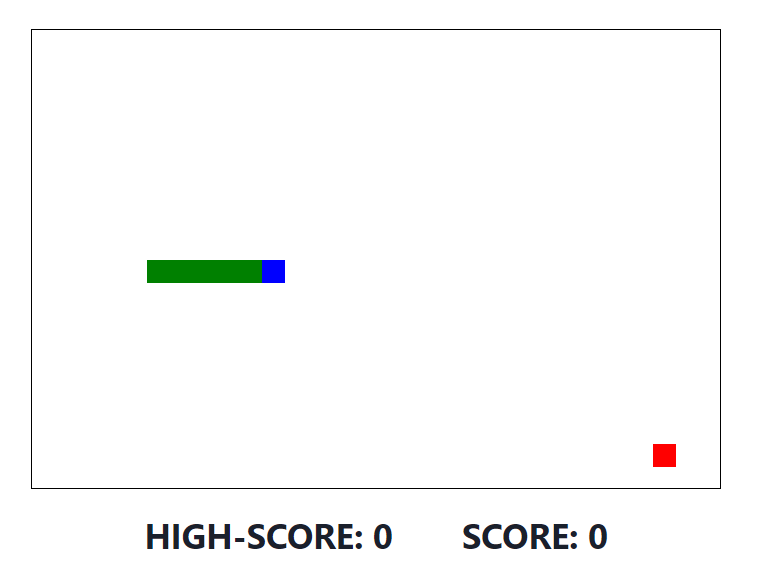

# Snake

## Table of contents

- [Overview](#overview)
  - [Screenshot](#screenshot)
  - [Links](#links)
- [My process](#my-process)
  - [Built with](#built-with)
  - [What I learned](#what-i-learned)
- [Author](#author)

## Overview

### Screenshot

### Links

- [Solution URL](https://github.com/klekwedge/snake)
- [Live Site URL](https://klekwedge-snake.vercel.app/)

## My process

### Built with

- React
- Redux Toolkit
- TypeScript
- Chakra UI
- Vite

### What I learned

I learned how to create the logic of the snake game, understood how to better switch between components, improved my skills in typing and working with state.

## Author

- [Website](https://klekwedge-cv.vercel.app/)
- [Linkedin](https://www.linkedin.com/in/klekwedge/)
- [Facebook](https://www.facebook.com/klekwedge)
